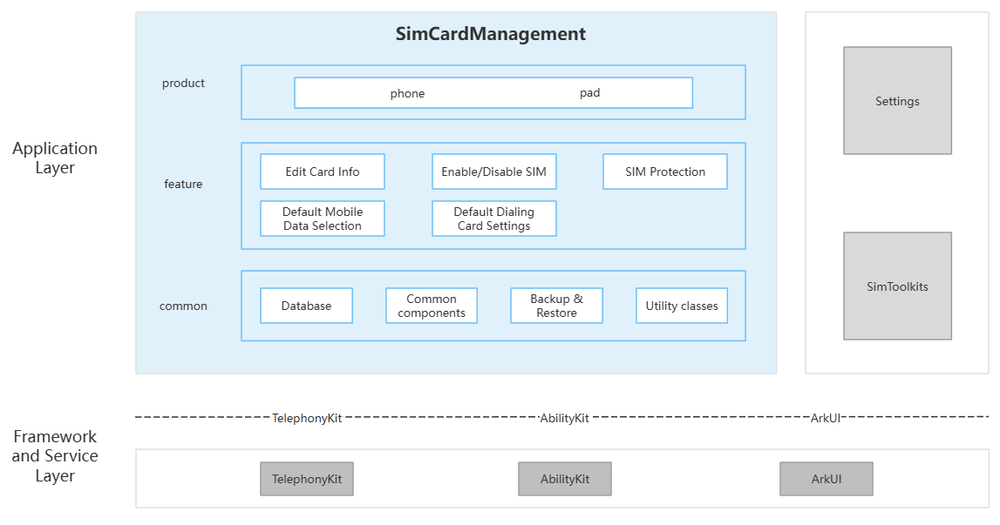

# SIM Management (SimCardManagement)

## Introduction

**SIM Management** (bundle name: `com.ohos.simcardmanagement`) is a **system application** in the OpenHarmony telephony subsystem. It displays slot and carrier information, and provides edit card info, enable/disable SIM, SIM protection, default mobile data selection, default dialing card settings, and STK linkage. It adapts to phone and tablet device forms.

### Main Capabilities

**Edit Card Info**
- Displays slot status, carrier, number, SPN, and related information.
- Supports editing the SIM display name and number; changes are written to the system through TelephonyKit.

**Enable/Disable SIM**
- Supports enabling or disabling a SIM by slot.
- Enable/disable state and slot information refresh as SIM / network status changes.

**SIM Protection**
- Provides the SIM protection settings entry and PIN / PUK related interactions.
- Can work with user authentication, lock screen, and other system capabilities.

**Default Mobile Data Selection**
- Supports selecting the default mobile data (Internet) card in dual-SIM scenarios.
- Both the home page and the control-center extension can trigger policy switching.

**Default Dialing Card Settings**
- Supports setting the default voice / dialing SIM slot.
- Stays consistent with the default calling-card policy on the telephony side.

**STK Linkage**
- Shows the SIM card application (STK) entry on the SIM management home page and jumps to SimToolkits by slot.
- Launches the STK app through AbilityKit and opens the SIM toolkit page for the corresponding slot.

## Architecture

SimCardManagement uses a layered, modular design organized by product entry, feature capabilities, and common capabilities, as shown below:



In the architecture figure, the common-layer **Settings Data Query** means this app does not own a business database; it accesses system Settings / Telephony SIM info through DataShare. The corresponding `database/` in the project only wraps query-related APIs.

### Application Layer Design

The overall structure is divided into product layer, feature layer, and common layer:

| Layer | Main directories / components | Description |
| ----- | --------------------------- | ----------- |
| Product layer | `entry` (phone/pad) | Phone / tablet HAP entry |
| Feature layer | `pages/`, `model/`, `uiExtensionAbility/`, `insightintents/`, `common/components/simToolkitsComponent` | Edit card info, enable/disable SIM, SIM protection, default mobile data, default dialing card, STK linkage |
| Common layer | `database/`, `common/`, `backup/`, `utils/` | Settings data query, shared components, backup/restore, utilities |

**Feature layer capability description**:

| Main capability | Key paths | Description (including TelephonyKit / launch APIs) |
| --------------- | ------- | ----------- |
| Edit card info | `common/components/cardInfomation.ets`, `dialog/editSimInfoDialog.ets` | Card info display and name/number editing; write-back calls `@ohos.telephony.sim` `setShowName` 、 `setShowNumber`; read can use `getShowName`, `getShowNumber`, `getSimSpn`, and so on |
| Enable/Disable SIM | `common/components/cardInfomation.ets`, `model/simServiceProxy.ets` | Enable/disable UI; query `isSimActive`; write via `SimServiceProxy.setSimActive` → `activateSim` 、 `deactivateSim` |
| SIM protection | `pages/simProtection.ets`, `common/components/pinComponent.ets`, `model/pinModel.ets` | PIN page and interactions; `pinModel` calls `getLockState` / `setLockState`, `unlockPin` 、 `unlockPuk`, `alterPin` via `@kit.TelephonyKit` |
| Default mobile data selection | `common/components/defaultDataComponent.ets`, `common/components/mobileDataToggleDialog.ets`, `uiExtensionAbility/MobileDataChangeExtAbility.ets`, `model/radioServiceProxy.ets` | Default data SIM: `radio.getPrimarySlotId` / `setPrimarySlotId`; control-center switch: `data.isCellularDataEnabled` 、 `enableCellularData`; when restricting switch during calls, use `call.getCallState` and `observer` call-state callbacks |
| Default dialing card settings | `common/components/dialog/selectDefaultVoiceDialog.ets`, `model/simServiceProxy.ets` | Default voice SIM settings dialog; core calls `@ohos.telephony.sim` `getDefaultVoiceSlotId` / `setDefaultVoiceSlotId` |
| STK linkage | `common/components/simToolkitsComponent.ets` | STK entry display and navigation; calls `startAbility` to launch `com.ohos.simtoolkits` 、 `EntryAbility` (parameters include `pageUrl`, `slotId`) |

**Common layer description**:

| Directory / component | Description |
| --------------------- | ----------- |
| `database/` (for example `DatabaseHelper.ets`; architecture figure: **Settings Data Query**) | **Not an app-owned business database**. Uses DataShare to access system Telephony SIM info (for example `datashare:///com.ohos.simability/sim/sim_info`) and Settings data (`settingsdata`), wrapping **query** helpers by ICCID / slot, and so on, for backup/restore and card-info correlation |
| `common/components/` | Reusable UI across SIM management features: card info area, default data SIM, PIN, default dialing dialog, SimToolkits (STK) entry, and so on |
| `common/utils/`, `common/config/`, `common/struct/` | SIM state constants, Settings listeners, auth utilities, card-info config and data structures |
| `backup/` | Backup/restore extension for SIM-related settings and display names (write-back still goes through TelephonyKit / Settings) |
| `utils/` | Device form, display, string and other general utilities that support SIM management page adaptation |

### Relationship with Other Applications

SimCardManagement works with **Settings**, **SceneBoard**, **SimToolkits**, and the telephony subsystem. It does not include Modem / RIL implementation and operates SIM / Radio / Data indirectly through TelephonyKit.

**Invocation**:

- Settings launches `com.ohos.simcardmanagement.MainAbility` through a UIExtension Want, and can integrate Settings search via `action.settings.search.path`.
- SceneBoard embeds mobile-data switching and default data-card UI through `MobileDataChangeExtAbility`.
- SimToolkits: home-page `SimToolkitsComponent` calls `startAbility` (`bundleName`=`com.ohos.simtoolkits`, `abilityName`=`EntryAbility`) to launch STK.
- Telephony read/write is described in **Telephony subsystem integration** below.

**Invocation scenarios**:

SIM management page inside Settings, Settings search, control-center mobile data switching, STK entry navigation, and so on.

**External interfaces**:

| Interface type | Interface identifier | Description |
|------|------|------|
| UIExtension (sys/commonUI) | `com.ohos.simcardmanagement.MainAbility` | Main Settings entry launches the SIM management page via Want |
| UIExtension (sys/commonUI) | `MobileDataChangeExtAbility` | Extension entry for mobile-data switching in SceneBoard control center |
| Metadata configuration | `action.settings.search.path` | Settings search path configuration for Settings to find and jump to this app capability |
| Extension (backup) | `BackupExtensionAbility` | Backup/restore for SIM-related settings |
| Extension (workScheduler) | `ReporterWorkSchedulerAbility` | Statistics reporting scheduler |

### Telephony subsystem integration

This app is the SIM management UI and does not implement baseband / RIL. UI actions go through **TelephonyKit** to the Telephony system service.

**Call chain**:

```text
User action → page / component → model wrapper → TelephonyKit → Telephony system service → modem / SIM
```

On status changes, subscribe via `@ohos.telephony.observer` to events such as `simStateChange` and `networkStateChange` to refresh the UI.

**Feature and call-chain mapping**:

`SimServiceProxy` (`model/simServiceProxy.ets`) wraps `@ohos.telephony.sim` calls. It sits between the page / component and TelephonyKit in the call chain, and handles SIM-side operations such as presence / enable-state queries, SIM activate/deactivate, display name / number read-write, and the default dialing card. Radio capabilities such as the default data SIM are wrapped by the similar `radioServiceProxy`.

- **Query SIM presence / enable state**
  - Call chain: card-info component → `simServiceProxy` → TelephonyKit
  - TelephonyKit module: `sim`
  - Typical APIs: `hasSimCard`, `isSimActive`, `getSimState`
  - Description: Query slot and enable state

- **Enable / disable SIM**
  - Call chain: `cardInfomation` → `SimServiceProxy.setSimActive` → TelephonyKit
  - TelephonyKit module: `sim`
  - Typical APIs: `activateSim`, `deactivateSim`
  - Description: Write slot enable state

- **Edit display name / number**
  - Call chain: `editSimInfoDialog` → `simServiceProxy` → TelephonyKit
  - TelephonyKit module: `sim`
  - Typical APIs: write `setShowName`, `setShowNumber`; read `getShowName`, `getShowNumber`, `getSimSpn`
  - Description: Write back system display fields

- **Default dialing card**
  - Call chain: `selectDefaultVoiceDialog` → `simServiceProxy` → TelephonyKit
  - TelephonyKit module: `sim`
  - Typical APIs: `getDefaultVoiceSlotId`, `setDefaultVoiceSlotId`
  - Description: Set default voice SIM

- **Default mobile data SIM**
  - Call chain: `defaultDataComponent` → `radioServiceProxy` → TelephonyKit
  - TelephonyKit module: `radio`
  - Typical APIs: `getPrimarySlotId`, `setPrimarySlotId`
  - Description: Set default data SIM

- **Control-center mobile data**
  - Call chain: `MobileDataChangeExtAbility` → `mobileDataToggleDialog` → TelephonyKit
  - TelephonyKit module: `radio`, `data`, `call`, `observer`
  - Typical APIs: `setPrimarySlotId`, `enableCellularData`, `getCallState`
  - Description: Switch default data SIM and master cellular data switch

- **SIM PIN / PUK**
  - Call chain: `simProtection`, `pinComponent` → `pinModel` → TelephonyKit
  - TelephonyKit module: `sim`
  - Typical APIs: `getLockState`, `setLockState`, `unlockPin`, `unlockPuk`, `alterPin`
  - Description: PIN on/off, unlock, and change PIN

- **Backup restore write-back**
  - Call chain: `backup`, `RestoreUtil` → TelephonyKit
  - TelephonyKit module: `sim`, `radio`
  - Typical APIs: `setShowName`, `setDefaultVoiceSlotId`, `deactivateSim`, `setPrimarySlotId`
  - Description: On restore, write back display name, default dial/data SIM, and deactivated state

Note: STK navigation uses AbilityKit `startAbility` and does not go through TelephonyKit.

## Build

This is a standalone HAP application project built with Hvigor. The product is the `com.ohos.simcardmanagement` system application package. The pipeline may rename the signed artifact to `SimCardManagement.hap` and preinstall it under `/system/app/SimCardManagement/`.

### Environment Requirements
- OpenHarmony SDK: see `build-profile.json5` (currently `compileSdkVersion` 26.0.0, `compatibleSdkVersion` 23, `targetSdkVersion` 23)
- DevEco Studio or command-line Hvigor toolchain
- System signing certificates (see `signature/`)

### Build Commands

Run in the project root (requires the Hvigor CLI `hvigorw` on PATH, or use DevEco Studio / the pipeline `build.sh`):

```bash
hvigorw assembleHap --mode module -p product=default -p debuggable=false -p buildMode=release
```

The default signed artifact is at `entry/build/default/outputs/default/entry-default-signed.hap`; `build.sh` can copy it to `SimCardManagement.hap` in the same directory.

## SimCardManagement Development

SimCardManagement is developed in **ArkTS**, with UI based on the ArkUI Stage model. The app hosts the main UI through `com.ohos.simcardmanagement.MainAbility`; `model/` wraps TelephonyKit (`@ohos.telephony.sim` / `radio`, and so on), and the common-layer `common/components/` implements feature UI. See: [ArkUI Development Overview](https://gitcode.com/openharmony/docs/blob/master/zh-cn/application-dev/ui/arkts-ui-development-overview.md)

### Development Based on Existing Modules

Typical use cases: customize existing SIM management capabilities such as card-info editing, SIM enable/disable, SIM protection, default data / dialing card, or STK entry presentation.

Common modification scenarios:

**Scenario 1: Add name validation when editing card info**

Through TelephonyKit, call `setShowName` / `setShowNumber` to write back the SIM display name and number (via `SimServiceProxy`); add validation before write-back. Entry: `editSimInfoDialog.ets`, `cardInfomation.ets`.
```typescript
    // editSimInfoDialog.ets
    function setShowName(editInfo: EditSimInfo, onSetShowNameResult: (slotId: number) => void, retryCount: number = 0) {
      // [Change point] extend name validation, empty handling, or a custom pre-check here
      if (!customValidateName(editInfo.newName)) {
        return;
      }
      ...
      // Ultimately calls TelephonyKit: sim.setShowName
      SimServiceProxy.setShowName(editInfo.slotId, editInfo.newName).then(() => {
        onSetShowNameResult(editInfo.slotId);
      })
      ...
    }
```

**Scenario 2: Add custom prompt when enabling/disabling SIM**

Through TelephonyKit, call `activateSim` / `deactivateSim` to enable or disable a slot (query `isSimActive`, via `SimServiceProxy.setSimActive`); extend custom prompts on success or failure. Entry: `cardInfomation.ets`, `simServiceProxy.ets`.
```typescript
    // cardInfomation.ets
    setSimActivated(slotId: number, isActivated: boolean) {
      ...
      // TelephonyKit: via SimServiceProxy.setSimActive → sim.activateSim / deactivateSim
      SimServiceProxy.setSimActive(slotId, isActivated).then(() => {
        // [Change point] extend custom prompt or follow-up handling after success
        this.handleSetActivateEnd(slotId, true);
      }).catch(() => {
        this.handleSetActivateEnd(slotId, false);
      });
    }
```

**Scenario 3: SIM protection linked with slot enable-state check**

Through TelephonyKit, call `isSimActive`, `getLockState` / `setLockState`, and `unlockPin` / `unlockPuk`, `alterPin`, and so on; link with slot enable state, then enter protection flows. Entry: `pinModel.ets`, `simProtection.ets`, `pinComponent.ets`.
```typescript
    // TelephonyKit: sim.isSimActive
    const isActive = SimServiceProxy.isSimActive(slotId);
```

**Scenario 4: Add pre-check when selecting default mobile data**

Through TelephonyKit, call `getPrimarySlotId` / `setPrimarySlotId` to set the default data SIM (via `radioServiceProxy`); add pre-checks before switching. Entry: `defaultDataComponent.ets`, `MobileDataChangeExtAbility.ets`, `radioServiceProxy.ets`.
```typescript
    // defaultDataComponent.ets
    setPrimarySlotId(slotId: number) {
      // [Change point] extend a custom pre-check here
      if (!this.customPreCheck(slotId)) {
        return;
      }
      ...
      // TelephonyKit: radio.setPrimarySlotId
      setPrimarySlotId(slotId).then(() => {
        this.onSetPrimarySlotIdFinished();
      })
      ...
    }
```

**Scenario 5: Add custom prompt when setting default dialing card**

Through TelephonyKit, call `getDefaultVoiceSlotId` / `setDefaultVoiceSlotId` to write the default dialing SIM (via `SimServiceProxy`); extend prompts on success or failure. Entry: `selectDefaultVoiceDialog.ets`, `simServiceProxy.ets`.
```typescript
    // selectDefaultVoiceDialog.ets
    export function setDefaultVoiceSlotId(slotId: number, onSetDefaultVoiceResult: (slotId: number) => void) {
      ...
      // TelephonyKit: sim.setDefaultVoiceSlotId
      SimServiceProxy.setDefaultVoiceSlotId(slotId).then((res: boolean) => {
        // [Change point] extend custom prompt after setting succeeds
        onSetDefaultVoiceResult(slotId);
      })
      ...
    }
```

**Scenario 6: STK linkage with custom validation before launch**

Through AbilityKit, call `startAbility` to launch `com.ohos.simtoolkits` / `EntryAbility` (parameters `pageUrl`, `slotId`); add checks before launch. Entry: `simToolkitsComponent.ets`.
```typescript
    // simToolkitsComponent.ets
    private stkMenuClick(slotId: number): void {
      // [Change point] extend slot / account checks before startAbility
      (getContext(this) as common.UIAbilityContext).startAbility({
        bundleName: 'com.ohos.simtoolkits',
        abilityName: 'EntryAbility',
        parameters: {
          'pageUrl': 'pages/Index',
          'slotId': slotId
        }
      });
    }
```

Common modification entries:

| Target | Path |
| ------ | ---- |
| App main entry (UIExtension) | `entry/src/main/ets/MainAbility/MainAbility.ets` |
| App home page | `entry/src/main/ets/pages/index.ets` |
| Edit card info | `entry/src/main/ets/common/components/cardInfomation.ets`, `dialog/editSimInfoDialog.ets` |
| Enable/Disable SIM | `model/simServiceProxy.ets`, `common/components/cardInfomation.ets` |
| SIM protection | `pages/simProtection.ets`, `model/pinModel.ets`, `PinViewModel.ets` |
| Default mobile data | `common/components/defaultDataComponent.ets`, `model/radioServiceProxy.ets` |
| Default dialing card | `common/components/dialog/selectDefaultVoiceDialog.ets`, `model/simServiceProxy.ets` |
| STK linkage | `common/components/simToolkitsComponent.ets` |
| Control-center mobile data | `uiExtensionAbility/MobileDataChangeExtAbility.ets` |
| Ability / permission declaration | `entry/src/main/module.json5` |
| Page route registration | `entry/src/main/resources/base/profile/main_pages.json` |

### Developing New Feature Capabilities

Typical use cases: extend interaction on existing SIM management capabilities, add system collaboration entries, or adapt to new device forms.

> **Note**: This project is a single `entry` HAP module. Product entry and Abilities are declared in `entry`. New capabilities are extended by product / feature / common layers; for Telephony-related changes, confirm permissions and `@ohos.telephony.*` APIs.

The following uses one abstract, reusable extension scenario as an example. Other capabilities can follow the same steps and map to the matching directories and APIs.

**Scenario 1: On existing default dialing card settings, add per-slot carrier tips or adjust pre-write validation**

Abstract extension steps:

1. Add TelephonyKit call wrappers in `model/simServiceProxy.ets` or a similar file.
2. Extend UI and interaction in `common/components/dialog/selectDefaultVoiceDialog.ets` or `pages/index.ets`.
3. If Settings / Telephony SIM info must be read, extend query paths in `database/DatabaseHelper.ets`; do not create an app-owned business database.
4. Add UT / cases under `entry/src/ohosTest`.
5. Confirm Ability entries, extension types, and permissions in `module.json5`.

The same approach applies to: refresh default data SIM after SIM enable/disable, add a pre-check before PIN change in SIM protection, hide STK entry by account, and so on—map each to the matching capability and TelephonyKit / `startAbility`.

The main UIExtension, control-center extension, and related entries are already declared in `entry/src/main/module.json5`. When extending, usually confirm:
```json
{
  "module": {
    "name": "entry",
    "type": "entry",
    "mainElement": "com.ohos.simcardmanagement.MainAbility",
    "extensionAbilities": [
      {
        "name": "com.ohos.simcardmanagement.MainAbility",
        "srcEntrance": "./ets/MainAbility/MainAbility.ets",
        "type": "sys/commonUI"
      },
      {
        "name": "MobileDataChangeExtAbility",
        "srcEntry": "./ets/uiExtensionAbility/MobileDataChangeExtAbility.ets",
        "type": "sys/commonUI",
        "exported": true
      }
    ]
  }
}
```

## Directory

```text
simcardmanagement
├─AppScope                              # SIM management app config (bundle name, icons, multi-language)
│  ├─app.json5                          # bundleName=com.ohos.simcardmanagement, version
│  └─resources/                         # Global SIM management strings and icons
├─docs                                  # SIM management documentation
│  └─figures/                           # Architecture figures (Settings data query, STK linkage, etc.)
├─entry                                 # Phone/pad HAP entry for SIM management
│  └─src/main/
│     ├─ets/
│     │  ├─Application/                 # AbilityStage init for the SIM management process
│     │  ├─MainAbility/                 # Settings SIM management home entry
│     │  ├─pages/                       # SIM home and SIM protection page
│     │  ├─uiExtensionAbility/          # Control-center extension to switch default data SIM
│     │  ├─model/                       # TelephonyKit wrappers for SIM on/off, default dial/data, PIN, and so on
│     │  ├─insightintents/              # Voice/intent: switch default data/dial SIM, enable/disable SIM
│     │  ├─common/                      # Shared capabilities across SIM features
│     │  │  ├─components/               # Edit card info, default data SIM, PIN, default dial, STK entry
│     │  │  ├─utils/                    # SIM state constants, card insertion listeners, PIN auth and privacy window
│     │  │  ├─config/                   # Card-info display items and dual-SIM policy related config
│     │  │  └─struct/                   # Slot info, operator name, and other business structs
│     │  ├─data/                        # SIM business data definitions such as card info and API responses
│     │  ├─database/                    # Query Settings / Telephony SIM info (not an app-owned business DB)
│     │  ├─backup/                      # Backup/restore SIM display name, default dial/data SIM, and so on
│     │  ├─WorkSchedulerExtension/      # Scheduled reporting for SIM management
│     │  └─utils/                       # Page adaptation, display scale, string handling
│     ├─resources/                      # SIM strings, Settings search path, multi-language resources
│     └─module.json5                    # SIM management Ability and Telephony-related permission declarations
│  └─src/ohosTest/                      # Hypium cases for SIM on/off, PIN, default card, etc.
├─hvigor                                # Hvigor build scripts
├─signature                             # System signing cert and profile for SIM management
├─build.sh                              # Build and rename artifact to SimCardManagement.hap
├─build-profile.json5                   # SDK and signing product config
├─oh-package.json5
├─OAT.xml                               # Open-source compliance audit
├─LICENSE
├─README.md                             # English documentation
└─README_zh.md                          # Chinese documentation
```

> Note: This project does not provide `bundle.json`. Module and product build information is defined in `build-profile.json5` and `entry/src/main/module.json5`.

## Constraints

- **Language**: ArkTS
- **Runtime form**: Pre-installed system application (`com.ohos.simcardmanagement`), depends on TelephonyKit (`@ohos.telephony.sim` / `radio` / `data` / `call`) and system privileged permissions; **does not include** RIL / Modem implementation
- **Device types**: Phone and tablet (see `entry/src/main/module.json5`)
- **Signing**: Requires a system signing profile (see `signature/simcardmanagement.p7b`)
- **Permissions**: The following are the main permissions declared in `entry/src/main/module.json5` and used by this project capability chain (`SET_TELEPHONY_STATE` is also declared in extension `permissions`)

  | Permission | Grant mode | Usage |
  | ---------- | ---------- | ----- |
  | ohos.permission.GET_TELEPHONY_STATE | System grant | Query whether a SIM is present, enable/disable state, default voice / data card state, and call-related state |
  | ohos.permission.SET_TELEPHONY_STATE | System grant | Enable/disable SIM and write default voice card / default mobile data card; STK launch Want scenarios also rely on this permission context |
  | ohos.permission.GET_NETWORK_INFO | User grant | Check network state before/after switching the default mobile data card to avoid invalid switches |
  | ohos.permission.USE_USER_IDM | User grant | User identity authentication before enabling/disabling PIN in SIM protection |
  | ohos.permission.ACCESS_BIOMETRIC | User grant | Fingerprint / face confirmation in SIM protection flows |
  | ohos.permission.PRIVACY_WINDOW | System grant | On the SIM protection PIN / PUK input screen, disable screenshot and screen recording (privacy window) |
  | ohos.permission.ACCESS_SYSTEM_SETTINGS | System grant | Read system settings (including Settings-search collaboration and STK main-menu visibility settings) |
  | ohos.permission.MANAGE_SETTINGS | System grant | Read/write dual-SIM / mobile-network related settings (collaborates with default data-card policy) |
  | ohos.permission.MANAGE_SECURE_SETTINGS | System grant | Read/write security-related settings |
  | ohos.permission.GET_BUNDLE_INFO | System grant | Query whether the STK app (`com.ohos.simtoolkits`) is installed to decide entry visibility |

- **External dependencies**: Settings (`com.ohos.settings`) embeds the main entry; SceneBoard provides the control-center extension; the SimToolkits STK launch bundle name is `com.ohos.simtoolkits` (see `SimToolkitsComponent`; keep it aligned with the actual STK app `bundleName` on product); the Telephony subsystem provides underlying capabilities

## Contributing

Contributions of code, documentation, and more are welcome. For the contribution process and details, see [Contributing](https://gitcode.com/openharmony/docs/blob/master/zh-cn/contribute/%E5%8F%82%E4%B8%8E%E8%B4%A1%E7%8C%AE.md).

## Related Repositories

[**applications_settings**](https://gitcode.com/openharmony/applications_settings)

[**simtoolkits**](https://gitcode.com/openharmony-sig/applications_simtoolkits.git)
