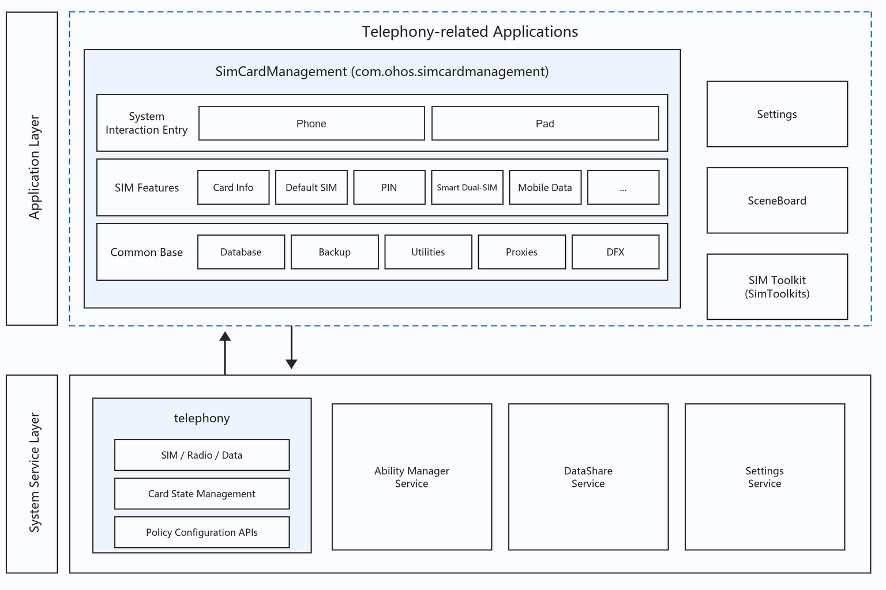
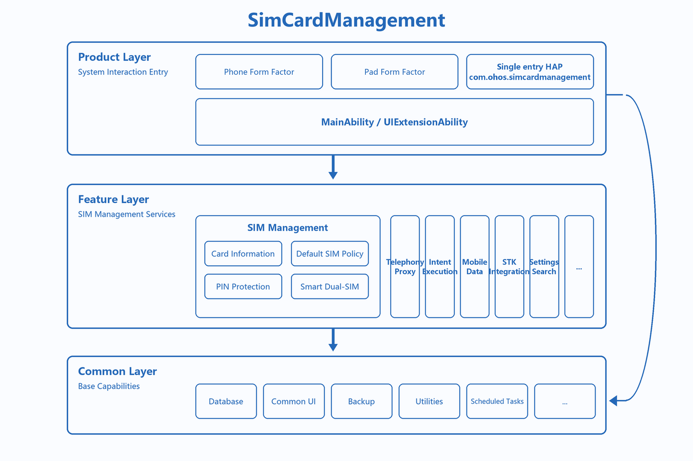
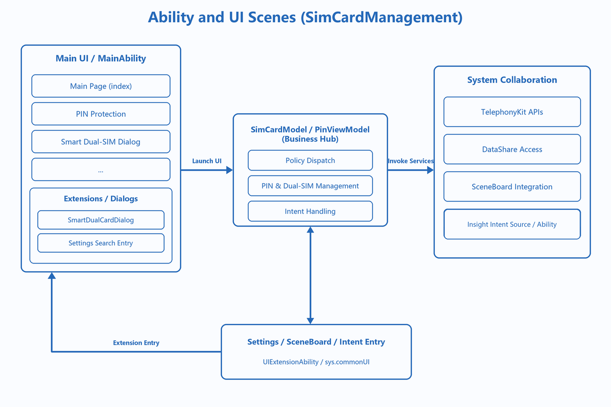
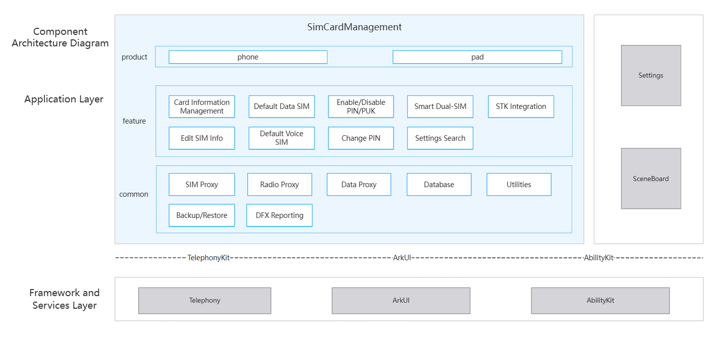
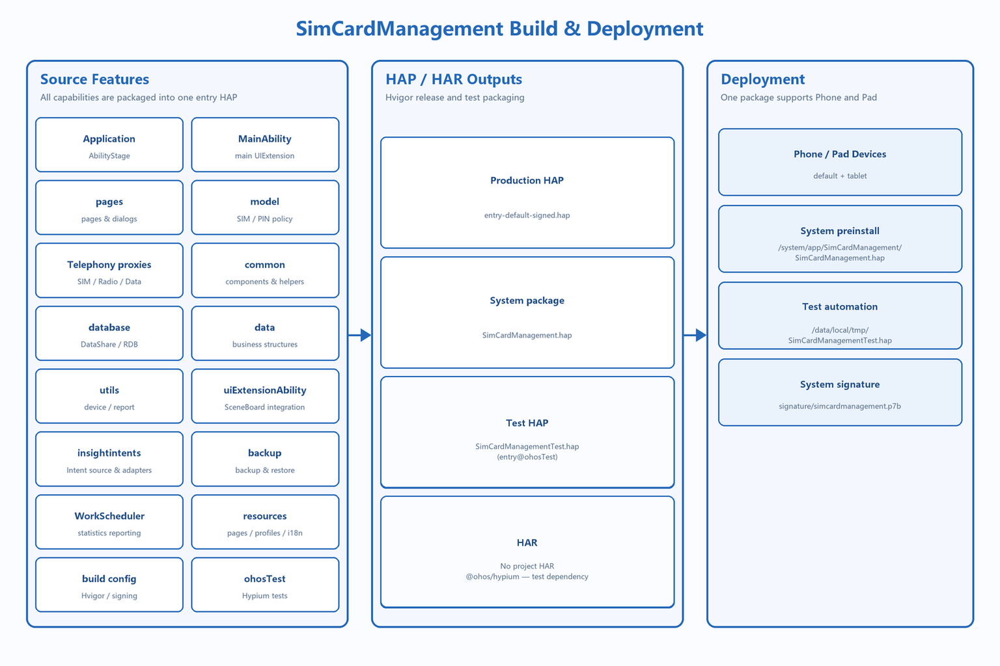

# SimCardManagement

## Introduction
**SimCardManagement** (bundle name: `com.ohos.simcardmanagement`) is a **SIM management system application** in the OpenHarmony telephony subsystem. It displays slot and carrier information, manages default data / voice card policy, provides PIN/PUK protection and smart dual-card switching, and collaborates with Settings, SceneBoard, Insight Intent, and SimToolkits.

This is a pre-installed system application. Users typically open it from **Settings → Mobile network → SIM management**. It supports device types such as Phone and Pad.

### Core Capabilities

**System Interaction Entry**
- Uses `UIExtensionAbility` (`sys/commonUI`) as the main entry (`com.ohos.simcardmanagement.MainAbility`).
- Supports launch from Settings search, the SceneBoard control center, and related system flows.
- Provides a smart dual-card dialog extension (`SmartDualCardDialogAbility`).

**SIM Information and Policy Management**
- Displays slot status, carrier name, number, and SPN.
- Supports SIM enable/disable, SIM name/number editing, default data card, and default voice card.
- Encapsulates TelephonyKit capabilities through `simServiceProxy`, `radioServiceProxy`, and `dataServiceProxy`.

**SIM Security**
- Supports PIN lock enable/disable, PIN change, and PIN/PUK unlock.
- Integrates with user authentication / lock-screen capabilities when required.

**System Integration**
- Integrates with SceneBoard control center through `MobileDataChangeExtAbility`.
- Provides Insight Intent source including `IntentExecutorImpl`, `insight_intent.json`, and `DefaultIntentBackgroundUiAbility`. The current `module.json5` does not declare the corresponding profile, so product integration must package and verify it before use.
- Supports backup/restore (declared as `BackupExtensionAbility`, implemented by `BackupExtension`) and periodic reporting (`ReporterWorkSchedulerAbility`).
- Collaborates with SimToolkits for STK entry linkage.

> **Note**: This repository is the SIM management **application layer**. Underlying SIM / Radio / Data capabilities are provided by the telephony subsystem. This app operates indirectly through TelephonyKit and does not modify the protocol stack.

### Relationship Between SimCardManagement and Telephony

SimCardManagement depends on the telephony subsystem and does not include Modem / RIL implementation.

**Events and call relationships**:
1. Settings and related entries launch `com.ohos.simcardmanagement.MainAbility`; SceneBoard collaborates through `MobileDataChangeExtAbility`. Insight Intent source is implemented by `IntentExecutorImpl` and takes effect after product-level profile integration.
2. This app queries and sets SIM / Radio / Data state and policies through TelephonyKit proxies.
3. Settings integration and STK entry visibility are coordinated through the Settings data service and `SimToolkitsComponent`, respectively.

> Example of a typical default data-card switch flow:
> - Settings search or the main page launches `MainAbility`;
> - `SimCardModel` / proxy layer reads current slot and data-card state;
> - After user selection, TelephonyKit writes the default data-card policy;
> - SceneBoard / control center can sync display through `MobileDataChangeExtAbility`.

## Architecture

SimCardManagement uses a layered, modular design and works with the telephony subsystem.

### Position in the System

SimCardManagement sits in the application layer. It relies on Telephony for SIM / Radio / Data capabilities, and works with Settings, SceneBoard, and SimToolkits for entry, control-center, and STK collaboration.



### Layered Design

The overall design can be divided into a product layer (Ability entry), a feature layer (SIM management), and a common layer (proxies / storage / utilities), as shown below:



| Layer | Main directories / components | Description |
| ---- | --------------- | ---- |
| Product / application entry | `MainAbility/`, `pages/`, `uiExtensionAbility/` | UIExtension main entry, page routing, control-center and dual-card dialog extensions |
| Feature / SIM business | `model/`, `insightintents/` | Card info and policy, PIN protection, smart dual-card, Intent execution |
| Common / base capabilities | `database/`, `common/`, `backup/`, `utils/`, `WorkSchedulerExtension/` | DataShare / storage, shared components, backup/restore, reporting and utilities |

### Ability and UI Scenes

Entries from Settings / SceneBoard / Intent are handled by business models, then update UI and collaborate with TelephonyKit / DataShare:



**Data flow overview**:

```text
Settings / SceneBoard / Intent
  → MainAbility / MobileDataChangeExtAbility
  → pages (index / simProtection / smartDualCardDialog)
  → SimCardModel / PinViewModel / IntentExecutorImpl
  → simServiceProxy / radioServiceProxy / dataServiceProxy
  → TelephonyKit / DataShare / Settings
```

### Component and External Dependencies

Internally the component is organized by product / feature / common capabilities. Cross-process collaboration uses TelephonyKit, Settings, and SceneBoard:
- Product Layer：Supports phone and pad device form factors.
- Feature Layer: Provides capabilities including Card Information Management, Default Data SIM, Default Voice SIM, Enable/Disable PIN/PUK, Change PIN, Smart Dual-SIM, STK Integration, and Settings Search.
- Common Layer: Encapsulates foundational capabilities such as SIM Proxy, Radio Proxy, Data Proxy, Database, Utilities, Backup/Restore, and DFX Reporting.

The Framework and Services Layer connects to Telephony through TelephonyKit, provides UI through ArkUI, and manages Ability lifecycle through AbilityKit; externally collaborates with Settings and SceneBoard for cross-process interaction:



### Module Description

| Module | Path | Description |
| ---- | ---- | ---- |
| AbilityStage | entry/src/main/ets/Application/ | App-level lifecycle entry |
| MainAbility | entry/src/main/ets/MainAbility/ | Main UIExtension and smart dual-card dialog Ability |
| Pages | entry/src/main/ets/pages/ | Home, PIN protection, smart dual-card, lock-screen related pages |
| Control-center extension | entry/src/main/ets/uiExtensionAbility/ | MobileDataChangeExtAbility |
| Domain models | entry/src/main/ets/model/ | SimCardModel, PinViewModel, telephony proxies |
| Intent capability source | entry/src/main/ets/insightintents/ | IntentExecutorImpl, adapters, and DefaultIntentBackgroundUiAbility |
| Data definitions | entry/src/main/ets/data/ | Data structures, Infos, ResponseInfo |
| Data access | entry/src/main/ets/database/ | DatabaseHelper / DataShare access |
| Common components | entry/src/main/ets/common/ | Card info, default card, PIN, smart dual-card components and utilities |
| Backup/restore | entry/src/main/ets/backup/ | BackupExtension implementation for the BackupExtensionAbility declaration |
| Scheduler | entry/src/main/ets/WorkSchedulerExtension/ | ReporterWorkSchedulerAbility statistics reporting |
| Utilities | entry/src/main/ets/utils/ | Device, display, reporting utilities |

## Build

This project is a standalone HAP app built with Hvigor. The pipeline renames the signed output to `SimCardManagement.hap`; the system test configuration deploys it to `/system/app/SimCardManagement/SimCardManagement.hap`.

The following diagram expands the complete source features, HAP / HAR outputs, and deployment. Phone and Pad share the same `entry` HAP; no standalone HAR is defined.



### Environment Requirements
- OpenHarmony SDK (`compileSdkVersion` 23, `compatibleSdkVersion` / `targetSdkVersion` 20)
- DevEco Studio or command-line Hvigor
- System signing materials (see `signature/`)

### Build Commands

Run from the project root:

```bash
hvigorw assembleHap --mode module -p product=default -p debuggable=false -p buildMode=release
```

The default signed output is `entry/build/default/outputs/default/entry-default-signed.hap`. `build.sh` copies it to `SimCardManagement.hap` in the same directory.

### Build Outputs

| Type | Output / target | Description |
| ---- | --------------- | ----------- |
| HAP | `entry-default-signed.hap` | Default signed output of the `entry` module |
| HAP | `SimCardManagement.hap` | System preinstall package renamed by `build.sh` |
| Test HAP | `SimCardManagementTest.hap` (module `entry@ohosTest`) | Generated by `packageTesting` and installed from `/data/local/tmp/` by the test configuration |
| Project HAR | None | No standalone HAR module is defined |
| Third-party test HAR | `@ohos/hypium` | Test-framework dependency in `oh-package.json5`, not a project build output |

When integrated into the OpenHarmony source tree, package this app as a preinstalled system application according to platform build rules.

## Developing SimCardManagement

SimCardManagement is developed in **ArkTS**, with UI based on the ArkUI Stage model. It embeds into Settings / system UI through `UIExtensionAbility` and manages SIM features through TelephonyKit proxies. See: [ArkUI Development Overview](https://gitcode.com/openharmony/docs/blob/master/en/application-dev/ui/arkts-ui-development-overview.md)

### Development Based on Existing Modules

Typical scenarios: customize default-card policy UI, extend PIN interaction, or trim smart dual-card logic.

**Adjusting or trimming existing modules**

1. Locate the change by business boundary: `model/` (policy and proxies), `pages/` / `common/components/` (UI), `uiExtensionAbility/` (control center), or `insightintents/` (intents).
2. For telephony capability changes:
    - SIM wrappers: `model/simServiceProxy.ets`
    - Radio / Data wrappers: `model/radioServiceProxy.ets` / `model/dataServiceProxy.ets`
    - PIN logic: `model/pinModel.ets` / `model/PinViewModel.ets`
3. When trimming a capability, remove page/component entry points first, then clean model calls and tests.

For example, `SimServiceProxy` wraps the TelephonyKit callback API in a Promise so that business code only passes a slot ID:

```typescript
export class SimServiceProxy {
  private searchHasSimCard(slotId: number,
    resolve: (value: boolean) => void = () => {},
    reject: (error: BusinessError<void>) => void = () => {}) {
    sim.hasSimCard(slotId, (error, data) => {
      if (error) {
        reject(error);
        return;
      }
      resolve(data);
    });
  }

  hasSimCard(slotId = 0) {
    return new Promise((resolve: (value: boolean) => void,
      reject: (reason?: BusinessError) => void) => {
      try {
        this.searchHasSimCard(slotId, resolve, reject);
      } catch (error) {
        reject(error);
      }
    });
  }
}
```

**Modifying existing UI**

- Main entry: `MainAbility`; main page: `pages/index.ets`
- PIN page: `pages/simProtection.ets`; smart dual-card: `pages/smartDualCardDialog.ets`
- Reusable components: `common/components/`

The main UIExtension stores the `session` in local state and loads the home page when the session is created:

```typescript
onSessionCreate(want: Want, session: UIExtensionContentSession) {
  const localStorage = new LocalStorage({ session });
  this.handleWantParams(want, localStorage);
  session.loadContent('pages/index', localStorage);
}
```

Common edit points:

| Target | Path |
| ---- | ---- |
| Home page | `pages/index.ets` |
| PIN protection | `pages/simProtection.ets`, `model/PinViewModel.ets` |
| Smart dual-card | `pages/smartDualCardDialog.ets`, `MainAbility/SmartDualCardDialogAbility.ets` |
| Control-center mobile data | `uiExtensionAbility/MobileDataChangeExtAbility.ets` |
| Intent execution | `insightintents/IntentExecutorImpl.ets` |

### Developing New Features

Typical scenarios: add SIM management policies, extend form-factor interaction, or add system collaboration.

**Step 1: Extend business models and proxies**
1. Add policy or proxy wrappers under `model/`.
2. If cross-process capabilities are required, confirm the corresponding TelephonyKit / Settings APIs.
3. Add unit tests or a documented manual verification path.

For example, wrap default voice-slot setting in `SimServiceProxy` for page callers:

```typescript
export class SimServiceProxy {
  setDefaultVoiceSlotId(slotId = 0) {
    return new Promise((resolve: (value: boolean) => void,
      reject: (reason?: BusinessError) => void) => {
      try {
        this.doSetDefaultVoiceSlotId(slotId, resolve, reject);
      } catch (error) {
        reject(error);
      }
    });
  }
}
```

**Step 2: Configure or verify Ability entries**

Main and extension entries are declared in `entry/src/main/module.json5`. Confirm that `mainElement`, extension types, and permissions meet the new scenario.

For example, the main UIExtension and smart dual-card dialog are declared as two `sys/commonUI` extensions:

```json
{
  "extensionAbilities": [
    {
      "name": "com.ohos.simcardmanagement.MainAbility",
      "srcEntrance": "./ets/MainAbility/MainAbility.ets",
      "type": "sys/commonUI"
    },
    {
      "name": "SmartDualCardDialogAbility",
      "srcEntry": "./ets/MainAbility/SmartDualCardDialogAbility.ets",
      "type": "sys/commonUI"
    }
  ]
}
```

**Step 3: Customize UI**

Extend pages or components under `pages/` and `common/components/`, and register new pages in the `src` array of `resources/base/profile/main_pages.json` (for example, add `pages/<new_page>`):

```json
{
  "src": [
    "pages/index",
    "pages/smartDualCardDialog",
    "common/components/mobileDataToggleDialog"
  ]
}
```

New pages can be launched via `MainAbility.onSessionCreate` with `loadContent` for the target scenario (see **Modifying existing UI** above).

## Directory
```text
simcardmanagement
├─AppScope                              # App-level config and multi-language resources
│  ├─app.json5                          # bundleName, version, and so on
│  └─resources/                         # Global string resources
├─docs                                  # Docs and architecture diagrams
│  └─figures/                           # Architecture diagrams
│     ├─simcardmanagement_in_os.png           # Position in the system (zh)
│     ├─simcardmanagement_architecture.png    # Layered architecture (zh)
│     ├─simcardmanagement_ability.png         # Ability and UI scenes (zh)
│     ├─simcardmanagement_ipc.png             # Component and external dependencies (zh)
│     ├─simcardmanagement_build.png           # Build and deployment (zh)
│     ├─simcardmanagement_in_os_en.png        # Position in the system (en)
│     ├─simcardmanagement_architecture_en.png # Layered architecture (en)
│     ├─simcardmanagement_ability_en.png      # Ability and UI scenes (en)
│     ├─simcardmanagement_ipc_en.png          # Component and external dependencies (en)
│     └─simcardmanagement_build_en.png        # Build and deployment (en)
├─entry                                 # Sole HAP module
│  ├─src/main/                          # Main source directory
│  │  ├─ets/                            # ArkTS business source
│  │  │  ├─Application/                 # AbilityStage
│  │  │  ├─MainAbility/                 # MainAbility / SmartDualCardDialogAbility
│  │  │  ├─uiExtensionAbility/          # MobileDataChangeExtAbility (control center)
│  │  │  ├─pages/                       # Main page, PIN, smart dual-card, and so on
│  │  │  ├─data/                        # Data structures such as Infos and ResponseInfo
│  │  │  ├─model/                       # Business models and Telephony proxies
│  │  │  ├─insightintents/              # Insight Intent source, adapters, and background Ability
│  │  │  ├─database/                    # DataShare / local storage
│  │  │  ├─common/                      # Components, configuration, data structures, and utilities
│  │  │  ├─backup/                      # BackupExtension restore support
│  │  │  ├─WorkSchedulerExtension/      # Periodic statistics reporting
│  │  │  └─utils/                       # Device, display, reporting utilities
│  │  ├─resources/                      # Module resources, multi-language, dark mode
│  │  └─module.json5                    # Ability and permission declarations
│  ├─src/ohosTest/                      # Hypium automated tests and test pages
│  ├─build-profile.json5                # Module-level build config
│  └─obfuscation-rules.txt              # Obfuscation rules
├─hvigor                                # Build tool config
├─signature                             # Signing certificates and profile
├─build.sh                              # Pipeline build, test packaging, and HAP rename script
├─build-profile.json5                   # Project-level SDK / signing / product config
├─oh-package.json5                      # Dependencies and package info
├─OAT.xml                               # Open-source compliance audit
├─LICENSE                               # Open-source license
├─README_zh.md                          # Chinese README
└─REAMDE.md                             # English README
```

## Constraints
- Language: ArkTS
- Runtime form: pre-installed system app (`com.ohos.simcardmanagement`), depends on TelephonyKit and privileged system permissions
- Device types: `default`, `tablet` (see `module.json5`)
- Signing: system signature profile required
- Module form: one `entry` HAP; Phone / Pad are device form factors, not separate HAPs
- Insight Intent: source and a profile file are present, but product integration must verify the profile is packaged into the HAP
- This repository does not include RIL / Modem source; SIM / Radio / Data are accessed through TelephonyKit

## Contribution

Contributions of code, documentation, and more are welcome. For the contribution process, see [Contribute](https://gitcode.com/openharmony/docs/blob/master/en/contribute/contribution.md).

## Related Repositories
- [telephony_core_service](https://gitcode.com/openharmony/telephony_core_service) (SIM / Radio core services)
- [telephony_telephony_data](https://gitcode.com/openharmony/telephony_telephony_data) (telephony data and DataShare services)
- [applications_settings](https://gitcode.com/openharmony/applications_settings) (system Settings entry)
- [window_scene_board](https://gitcode.com/openharmony-sig/window_scene_board) (control center and window scenes)
