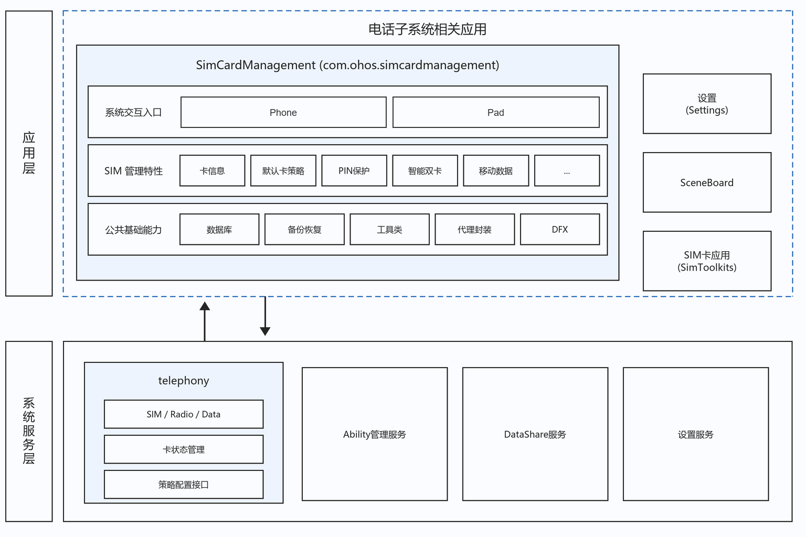
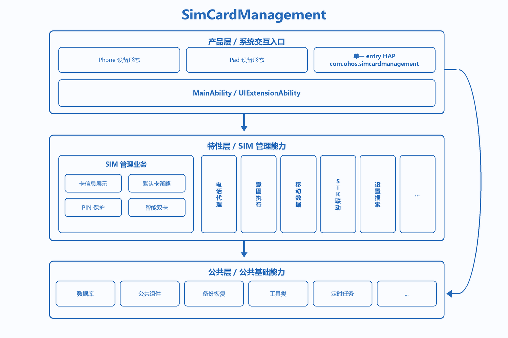
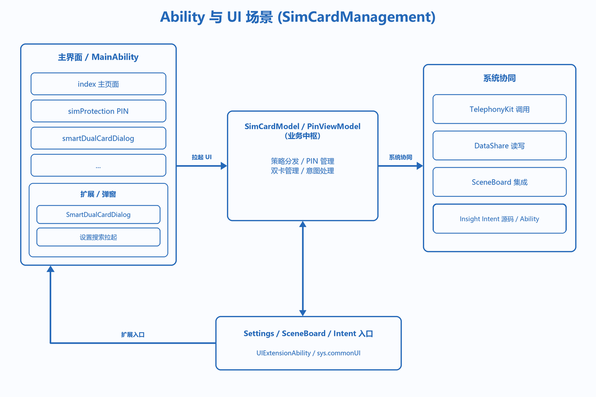
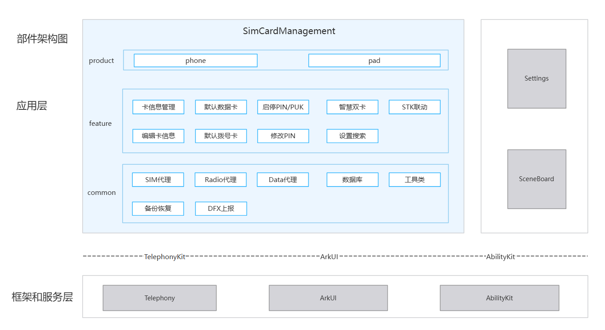
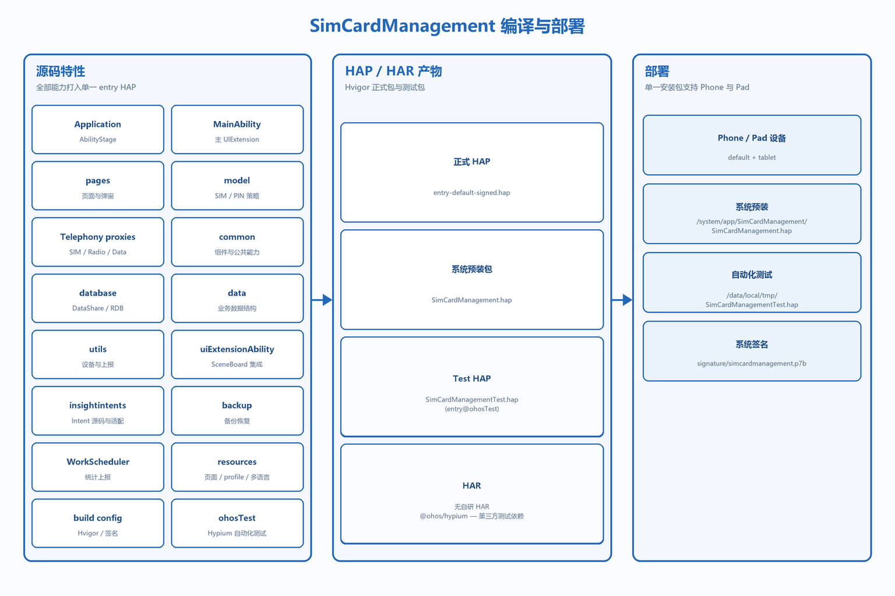

# SimCardManagement

## 简介
**SimCardManagement**（包名：`com.ohos.simcardmanagement`）是 OpenHarmony 电话子系统中的 **SIM 卡管理系统应用**，负责展示卡槽与运营商信息、管理默认数据卡 / 拨号卡策略、提供 PIN/PUK 安全保护与智能双卡切换，并与设置、SceneBoard、Insight Intent、SimToolkits 等系统组件协同工作。

本应用为系统预置应用，通常通过「设置 → 移动网络 → SIM 卡管理」等入口进入，支持 Phone、Pad等设备形态。

### 核心能力

**系统交互入口**
- 使用 `UIExtensionAbility`（`sys/commonUI`）作为主入口（`com.ohos.simcardmanagement.MainAbility`）。
- 支持从设置搜索、SceneBoard 控制中心及相关系统流程拉起。
- 提供智能双卡对话框扩展（`SmartDualCardDialogAbility`）。

**SIM 信息与策略管理**
- 展示卡槽状态、运营商、号码、SPN 等信息。
- 支持 SIM 启停、SIM 名称/号码编辑、默认移动数据卡、默认拨号卡设置。
- 通过 `simServiceProxy`、`radioServiceProxy`、`dataServiceProxy` 封装 TelephonyKit 能力。

**SIM 安全能力**
- 支持 PIN 锁开关、PIN 修改、PIN/PUK 解锁。
- 可按场景与用户认证 / 锁屏能力联动。

**系统集成能力**
- 通过 `MobileDataChangeExtAbility` 与 SceneBoard 控制中心集成。
- 提供 `IntentExecutorImpl`、`insight_intent.json` 与 `DefaultIntentBackgroundUiAbility` 等 Insight Intent 源码；当前 `module.json5` 未声明对应 profile，实际生效需由产品集成时完成打包与验证。
- 支持备份恢复（声明名 `BackupExtensionAbility`，实现类 `BackupExtension`）与定时统计（`ReporterWorkSchedulerAbility`）。
- 与 SimToolkits 协同完成 STK 入口联动。

> **说明**：本仓定位为 SIM 卡管理 **应用层**。底层 SIM / Radio / Data 能力由 Telephony 子系统提供；本应用通过 TelephonyKit 接口间接操作，不直接修改协议栈。

### SimCardManagement 与 Telephony 的关系

SimCardManagement 依赖电话子系统（Telephony），本身不包含 Modem / RIL 实现。

**事件与调用关系上**：
1. 设置等入口拉起 `com.ohos.simcardmanagement.MainAbility`，SceneBoard 通过 `MobileDataChangeExtAbility` 协同；Insight Intent 相关源码由 `IntentExecutorImpl` 承载，需在 profile 完成产品集成后生效。
2. 本应用通过 TelephonyKit 代理查询 / 设置 SIM、Radio、Data 相关状态与策略。
3. 设置入口与 STK 入口显隐分别通过 Settings 数据服务和 `SimToolkitsComponent` 协同完成。

> 例如，一次典型的默认数据卡切换流程：
> - 设置搜索或主页面拉起 `MainAbility`；
> - `SimCardModel` / 代理层读取当前卡槽与数据卡状态；
> - 用户选择后通过 TelephonyKit 写入默认数据卡策略；
> - SceneBoard / 控制中心侧可经 `MobileDataChangeExtAbility` 同步展示。

## 架构说明

SimCardManagement 采用分层与模块化设计，并与电话子系统协同工作。

### 在系统中的定位

SimCardManagement 位于应用层，依赖 Telephony 提供 SIM / Radio / Data 能力，同时与设置、SceneBoard、SimToolkits 协同完成入口、控制中心与 STK 联动。



### 分层设计

整体可划分为产品层（Ability 入口）、特性层（SIM 管理能力）、公共层（代理 / 存储 / 工具），如图：



| 层次 | 主要目录 / 组件 | 说明 |
| ---- | --------------- | ---- |
| 产品层 / 应用入口 | `MainAbility/`、`pages/`、`uiExtensionAbility/` | UIExtension 主入口、页面路由、控制中心与双卡对话框扩展 |
| 特性层 / SIM 业务 | `model/`、`insightintents/` | 卡信息与策略、PIN 保护、智能双卡、Intent 执行 |
| 公共层 / 基础能力 | `database/`、`common/`、`backup/`、`utils/`、`WorkSchedulerExtension/` | DataShare / 存储、公共组件、备份恢复、上报与工具 |

### Ability 与 UI 场景

事件由设置 / SceneBoard / Intent 拉起，经业务模型处理后更新 UI，并通过 TelephonyKit / DataShare 与系统协同：



**数据流概览**：

```text
Settings / SceneBoard / Intent
  → MainAbility / MobileDataChangeExtAbility
  → pages (index / simProtection / smartDualCardDialog)
  → SimCardModel / PinViewModel / IntentExecutorImpl
  → simServiceProxy / radioServiceProxy / dataServiceProxy
  → TelephonyKit / DataShare / Settings
```

### 部件与外部依赖

部件内部按产品 / 特性 / 公共能力组织，通过 TelephonyKit、Settings、SceneBoard 完成跨进程协作：
- 产品层：支持 phone 与 pad 两种设备形态。
- 特性层：提供卡信息管理、默认数据卡、默认拨号卡、启停PIN/PUK、修改PIN、智慧双卡、STK联动、设置搜索等能力。
- 公共层：封装 SIM代理、Radio代理、Data代理、数据库、工具类、备份恢复与 DFX 上报等基础能力。

框架和服务层通过 TelephonyKit 对接 Telephony，通过 ArkUI 提供界面，通过 AbilityKit 管理 Ability 生命周期；外部与 Settings、SceneBoard 协作完成跨进程交互：



### 模块说明

| 模块 | 路径 | 说明 |
| ---- | ---- | ---- |
| AbilityStage | entry/src/main/ets/Application/ | 应用级生命周期入口 |
| MainAbility | entry/src/main/ets/MainAbility/ | 主 UIExtension 与智能双卡对话框 Ability |
| 页面 | entry/src/main/ets/pages/ | 主页、PIN 保护、智能双卡、锁屏相关页 |
| 控制中心扩展 | entry/src/main/ets/uiExtensionAbility/ | MobileDataChangeExtAbility |
| 业务模型 | entry/src/main/ets/model/ | SimCardModel、PinViewModel、电话代理封装 |
| 意图能力源码 | entry/src/main/ets/insightintents/ | IntentExecutorImpl、适配器与 DefaultIntentBackgroundUiAbility |
| 数据定义 | entry/src/main/ets/data/ | Infos、ResponseInfo 等数据结构 |
| 数据访问 | entry/src/main/ets/database/ | DatabaseHelper / DataShare 访问 |
| 公共组件 | entry/src/main/ets/common/ | 卡信息、默认卡、PIN、智能双卡等组件与工具 |
| 备份恢复 | entry/src/main/ets/backup/ | BackupExtensionAbility 声明对应的 BackupExtension 实现 |
| 定时上报 | entry/src/main/ets/WorkSchedulerExtension/ | ReporterWorkSchedulerAbility 统计上报 |
| 工具 | entry/src/main/ets/utils/ | 设备、显示、上报等工具 |

## 编译构建

本工程为独立 HAP 应用工程，使用 Hvigor 构建。流水线将签名产物重命名为 `SimCardManagement.hap`，系统测试配置部署到 `/system/app/SimCardManagement/SimCardManagement.hap`。

下图按“完整源码特性 → HAP / HAR 产物 → 设备部署”展开；Phone 与 Pad 共用同一个 `entry` HAP，当前没有独立 HAR。



### 环境要求
- OpenHarmony SDK（本工程 `compileSdkVersion` 为 23，`compatibleSdkVersion` / `targetSdkVersion` 为 20）
- DevEco Studio 或命令行 Hvigor 工具链
- 系统签名证书（见 `signature/`）

### 编译命令

在工程根目录执行：

```bash
hvigorw assembleHap --mode module -p product=default -p debuggable=false -p buildMode=release
```

默认签名产物位于 `entry/build/default/outputs/default/entry-default-signed.hap`；`build.sh` 将其复制为同目录下的 `SimCardManagement.hap`。

### 构建产物

| 类型 | 产物 / 目标 | 说明 |
| ---- | ----------- | ---- |
| HAP | `entry-default-signed.hap` | `entry` 模块默认签名产物 |
| HAP | `SimCardManagement.hap` | `build.sh` 重命名后的系统预装包 |
| 测试 HAP | `SimCardManagementTest.hap`（模块 `entry@ohosTest`） | `packageTesting` 生成，测试配置从 `/data/local/tmp/` 安装 |
| 自研 HAR | 无 | 当前没有独立 HAR 模块 |
| 第三方测试 HAR | `@ohos/hypium` | `oh-package.json5` 中的测试框架依赖，不是本工程构建产物 |

若作为 OpenHarmony 系统部件合入源码树，可参考平台统一构建方式，将本应用作为预置系统应用打包进镜像。

## SimCardManagement 开发

SimCardManagement 采用 **ArkTS** 语言开发，UI 基于 ArkUI Stage 模型，通过 `UIExtensionAbility` 嵌入设置 / 系统 UI，通过 TelephonyKit 代理完成 SIM 管理。可开发参考：[ArkUI 开发概述](https://gitcode.com/openharmony/docs/blob/master/zh-cn/application-dev/ui/arkts-ui-development-overview.md)

### 基于已有模块的开发

适用场景：对已有能力做功能定制，例如调整默认卡策略 UI、扩展 PIN 交互、裁剪智能双卡逻辑等。

**对已有模块的功能调整与裁剪**

1. 明确改动落点：按业务边界定位到 `model/`（策略与代理）、`pages/` / `common/components/`（UI）、`uiExtensionAbility/`（控制中心）或 `insightintents/`（意图）。
2. 调整电话能力调用时：
    - SIM 相关封装位于 `model/simServiceProxy.ets`；
    - Radio / Data 相关封装位于 `model/radioServiceProxy.ets` / `model/dataServiceProxy.ets`；
    - PIN 相关位于 `model/pinModel.ets` / `model/PinViewModel.ets`。
3. 裁剪某项能力时：先移除页面 / 组件入口，再清理模型调用与测试用例，避免残留依赖。

例如，`SimServiceProxy` 将 TelephonyKit 的回调接口封装为 Promise，业务层只需传入卡槽 ID：

```typescript
export class SimServiceProxy {
  private searchHasSimCard(slotId: number,
    resolve: (value: boolean) => void = () => {},
    reject: (error: BusinessError<void>) => void = () => {}) {
    sim.hasSimCard(slotId, (error, data) => {
      if (error) {
        reject(error);
        return;
      }
      resolve(data);
    });
  }

  hasSimCard(slotId = 0) {
    return new Promise((resolve: (value: boolean) => void,
      reject: (reason?: BusinessError) => void) => {
      try {
        this.searchHasSimCard(slotId, resolve, reject);
      } catch (error) {
        reject(error);
      }
    });
  }
}
```

**对已有 UI 进行修改**

- 主入口为 `MainAbility`，主页面为 `pages/index.ets`。
- PIN 保护页：`pages/simProtection.ets`；智能双卡：`pages/smartDualCardDialog.ets`。
- 可复用组件位于 `common/components/`。

主 UIExtension 在会话创建后把 `session` 写入局部状态，并加载主页：

```typescript
onSessionCreate(want: Want, session: UIExtensionContentSession) {
  const localStorage = new LocalStorage({ session });
  this.handleWantParams(want, localStorage);
  session.loadContent('pages/index', localStorage);
}
```

常用修改入口：

| 目标 | 路径 |
| ---- | ---- |
| 主页面 | `pages/index.ets` |
| PIN 保护 | `pages/simProtection.ets`、`model/PinViewModel.ets` |
| 智能双卡 | `pages/smartDualCardDialog.ets`、`MainAbility/SmartDualCardDialogAbility.ets` |
| 控制中心移动数据 | `uiExtensionAbility/MobileDataChangeExtAbility.ets` |
| 意图执行 | `insightintents/IntentExecutorImpl.ets` |

### 新特性开发

适用场景：新增 SIM 管理策略、扩展设备形态交互、补充系统协同能力。

**步骤1：扩展业务模型与代理**
1. 在 `model/` 中补充策略或代理封装。
2. 如需跨进程能力，确认 TelephonyKit / Settings 接口可用。
3. 补充对应单测或手动验证路径。

例如，在 `SimServiceProxy` 中封装默认语音卡设置，供页面直接调用：

```typescript
export class SimServiceProxy {
  setDefaultVoiceSlotId(slotId = 0) {
    return new Promise((resolve: (value: boolean) => void,
      reject: (reason?: BusinessError) => void) => {
      try {
        this.doSetDefaultVoiceSlotId(slotId, resolve, reject);
      } catch (error) {
        reject(error);
      }
    });
  }
}
```

**步骤2：配置 / 确认 Ability 入口**

主入口与扩展在 `entry/src/main/module.json5` 中声明，扩展能力时通常需确认 `mainElement`、extension 类型与权限是否满足新场景。

例如，主 UIExtension 与智能双卡弹窗使用两个 `sys/commonUI` 声明：

```json
{
  "extensionAbilities": [
    {
      "name": "com.ohos.simcardmanagement.MainAbility",
      "srcEntrance": "./ets/MainAbility/MainAbility.ets",
      "type": "sys/commonUI"
    },
    {
      "name": "SmartDualCardDialogAbility",
      "srcEntry": "./ets/MainAbility/SmartDualCardDialogAbility.ets",
      "type": "sys/commonUI"
    }
  ]
}
```

**步骤3：定制 UI**

在 `pages/` 与 `common/components/` 中扩展页面或组件，并在 `resources/base/profile/main_pages.json` 的 `src` 数组中注册新页面（例如新增 `pages/<new_page>`）：

```json
{
  "src": [
    "pages/index",
    "pages/smartDualCardDialog",
    "common/components/mobileDataToggleDialog"
  ]
}
```

新页面可由 `MainAbility.onSessionCreate` 按场景 `loadContent` 拉起（见上文「对已有 UI 进行修改」）。

## 目录
```text
simcardmanagement
├─AppScope                              # 应用级配置与多语言资源
│  ├─app.json5                          # bundleName、版本号等
│  └─resources/                         # 全局 string 等资源
├─docs                                  # 文档与架构图
│  └─figures/                           # 架构图
│     ├─simcardmanagement_in_os.png           # 系统中定位（中文）
│     ├─simcardmanagement_architecture.png    # 分层架构（中文）
│     ├─simcardmanagement_ability.png         # Ability 与 UI 场景（中文）
│     ├─simcardmanagement_ipc.png             # 部件与外部依赖（中文）
│     ├─simcardmanagement_build.png           # 编译部署（中文）
│     ├─simcardmanagement_in_os_en.png        # 系统中定位（英文）
│     ├─simcardmanagement_architecture_en.png # 分层架构（英文）
│     ├─simcardmanagement_ability_en.png      # Ability 与 UI 场景（英文）
│     ├─simcardmanagement_ipc_en.png          # 部件与外部依赖（英文）
│     └─simcardmanagement_build_en.png        # 编译部署（英文）
├─entry                                 # 唯一 HAP 模块
│  ├─src/main/                          # 主源码目录
│  │  ├─ets/                            # ArkTS 业务源码
│  │  │  ├─Application/                 # AbilityStage
│  │  │  ├─MainAbility/                 # MainAbility / SmartDualCardDialogAbility
│  │  │  ├─uiExtensionAbility/          # MobileDataChangeExtAbility（控制中心）
│  │  │  ├─pages/                       # 主页面、PIN、智能双卡等
│  │  │  ├─data/                        # Infos、ResponseInfo 等数据结构
│  │  │  ├─model/                       # 业务模型与 Telephony 代理
│  │  │  ├─insightintents/              # Insight Intent 源码、适配器与后台 Ability
│  │  │  ├─database/                    # DataShare / 本地存储
│  │  │  ├─common/                      # 组件、配置、数据结构、工具
│  │  │  ├─backup/                      # BackupExtension 备份恢复
│  │  │  ├─WorkSchedulerExtension/      # 定时统计上报
│  │  │  └─utils/                       # 设备、显示、上报等工具
│  │  ├─resources/                      # 模块资源、多语言、深色模式等
│  │  └─module.json5                    # Ability、权限声明
│  ├─src/ohosTest/                      # Hypium 自动化测试与测试页面
│  ├─build-profile.json5                # 模块级构建配置
│  └─obfuscation-rules.txt              # 混淆规则
├─hvigor                                # 构建工具配置
├─signature                             # 签名证书与 profile
├─build.sh                              # 流水线构建、测试打包与 HAP 重命名脚本
├─build-profile.json5                   # 工程级 SDK / 签名 / product 配置
├─oh-package.json5                      # 依赖与包信息
├─OAT.xml                               # 开源合规审计
├─LICENSE                               # 开源许可证
├─README_zh.md                          # 中文说明
└─REAMDE.md                          # 英文说明
```

## 约束
- 语言版本：ArkTS
- 运行形态：系统预置应用（`com.ohos.simcardmanagement`），依赖 TelephonyKit 及系统特权权限
- 设备类型：`default`、`tablet`（见 `module.json5`）
- 签名要求：需使用系统签名 profile
- 模块形态：仅有一个 `entry` HAP；Phone / Pad 是设备形态，不是独立 HAP
- Insight Intent：仓内已提供源码和 profile 文件，但需在产品集成时确认 profile 已打入 HAP
- 本仓不包含 RIL / Modem 源码；通过 TelephonyKit 间接操作 SIM / Radio / Data

## 参与贡献

欢迎广大开发者贡献代码、文档等，具体的贡献流程和方式请参见[参与贡献](https://gitcode.com/openharmony/docs/blob/master/zh-cn/contribute/%E5%8F%82%E4%B8%8E%E8%B4%A1%E7%8C%AE.md)。

## 相关仓
- [telephony_core_service](https://gitcode.com/openharmony/telephony_core_service)（SIM / Radio 核心服务）
- [telephony_telephony_data](https://gitcode.com/openharmony/telephony_telephony_data)（电话数据与 DataShare 服务）
- [applications_settings](https://gitcode.com/openharmony/applications_settings)（系统设置入口）
- [window_scene_board](https://gitcode.com/openharmony-sig/window_scene_board)（控制中心与窗口场景）
