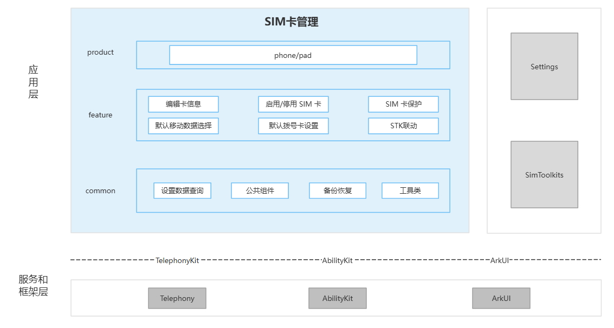

# SIM 卡管理（SimCardManagement）

## 简介

**SIM 卡管理**（包名：`com.ohos.simcardmanagement`）是 OpenHarmony 电话子系统中的 **系统应用**，负责卡槽与运营商信息展示，并提供编辑卡信息、启用/停用 SIM 卡、SIM 卡保护、默认移动数据选择、默认拨号卡设置与 STK 联动等能力，适配手机、平板设备形态。

### 主要能力

**编辑卡信息**
- 展示卡槽状态、运营商、号码、SPN 等信息。
- 支持编辑 SIM 显示名称与号码，变更通过 TelephonyKit 写入系统。

**启用/停用 SIM 卡**
- 支持按卡槽启用或停用 SIM 卡。
- 启停状态与卡槽信息随 SIM / 网络状态变化刷新。

**SIM 卡保护**
- 提供 SIM 卡保护设置入口与 PIN / PUK 相关交互。
- 可与用户认证、锁屏等系统能力联动。

**默认移动数据选择**
- 支持在双卡场景下选择默认移动数据（上网）卡。
- 主页与控制中心扩展均可触发策略切换。

**默认拨号卡设置**
- 支持设置默认语音 / 拨号使用的 SIM 卡槽。
- 与通话侧默认卡策略保持一致。

**STK 联动**
- 在 SIM 卡管理主页展示 SIM 卡应用（STK）入口，按卡槽跳转到 SimToolkits。
- 通过 AbilityKit 拉起 STK 应用，进入对应卡槽的 SIM 工具包页面。

## 架构说明

SimCardManagement 采用分层与模块化设计，按产品入口、业务特性与公共能力组织代码，如图：



架构图 common 中的 **设置数据查询**：本应用不自建业务库，通过 DataShare 访问系统 Settings / Telephony 卡信息数据，对应工程 `database/`，仅提供查询等接口封装。

### 应用层分层设计

整体可划分为产品层、特性层、公共层：

| 层次   | 主要目录 / 组件 | 说明 |
|------| -------------- | ---- |
| 产品层 | `entry`（phone/pad） | 手机 / 平板形态 HAP 入口 |
| 特性层 | `pages/`、`model/`、`uiExtensionAbility/`、`insightintents/`、`common/components/simToolkitsComponent` | 编辑卡信息、启停 SIM、SIM 卡保护、默认移动数据、默认拨号卡、STK 联动 |
| 公共层 | `database/`、`common/`、`backup/`、`utils/` | 设置数据查询、公共组件、备份恢复、工具类 |

**特性层能力说明**：

| 主要能力 | 关键路径 | 说明（含 TelephonyKit / 拉起接口） |
|--------|----------------|------|
| 编辑卡信息 | `common/components/cardInfomation.ets`、`dialog/editSimInfoDialog.ets` | 卡信息展示与名称/号码编辑；写回调用 `@ohos.telephony.sim` 的 `setShowName` 、 `setShowNumber`，读取可用 `getShowName`、`getShowNumber`、`getSimSpn` 等 |
| 启用/停用 SIM 卡 | `common/components/cardInfomation.ets`、`model/simServiceProxy.ets` | 启停 UI；查询 `isSimActive`；写入经 `SimServiceProxy.setSimActive` → `activateSim` 、 `deactivateSim` |
| SIM 卡保护 | `pages/simProtection.ets`、`common/components/pinComponent.ets`、`model/pinModel.ets` | PIN 页与交互；`pinModel` 经 `@kit.TelephonyKit` 调用 `getLockState` / `setLockState`、`unlockPin` 、 `unlockPuk`、`alterPin` |
| 默认移动数据选择 | `common/components/defaultDataComponent.ets`、`common/components/mobileDataToggleDialog.ets`、`uiExtensionAbility/MobileDataChangeExtAbility.ets`、`model/radioServiceProxy.ets` | 默认上网卡：`radio.getPrimarySlotId` / `setPrimarySlotId`；控制中心开关：`data.isCellularDataEnabled` 、 `enableCellularData`；通话中限制切换时用 `call.getCallState` 与 `observer` 通话状态回调 |
| 默认拨号卡设置 | `common/components/dialog/selectDefaultVoiceDialog.ets`、`model/simServiceProxy.ets` | 默认语音卡设置弹窗；核心调用 `@ohos.telephony.sim` 的 `getDefaultVoiceSlotId` / `setDefaultVoiceSlotId` |
| STK 联动 | `common/components/simToolkitsComponent.ets` | STK 入口展示与跳转；调用 `startAbility` 拉起 `com.ohos.simtoolkits` 、 `EntryAbility`（参数含 `pageUrl`、`slotId`） |

**公共层说明**：

| 目录 / 组件 | 说明 |
|------|------|
| `database/`（如 `DatabaseHelper.ets`，架构图：**设置数据查询**） | **非本应用自建业务库**。通过 DataShare 访问系统 Telephony 卡信息（如 `datashare:///com.ohos.simability/sim/sim_info`）及 Settings 数据（如 `settingsdata`），封装按 ICCID / 卡槽等**查询**能力，供备份恢复、卡信息关联等场景使用 |
| `common/components/` | SIM 卡管理各特性复用的 UI：卡信息区、默认上网卡、PIN、默认拨号弹窗、SimToolkits（STK）入口等 |
| `common/utils/`、`common/config/`、`common/struct/` | SIM 状态常量、Settings 监听、认证工具、卡信息配置与数据结构 |
| `backup/` | SIM 相关设置与显示名等的备份恢复扩展（写回时仍走 TelephonyKit / Settings） |
| `utils/` | 设备形态、显示、字符串等通用工具，支撑 SIM 管理页适配 |

### 与其它应用的关系

SimCardManagement 与 **系统设置**、**SceneBoard**、**SimToolkits** 及电话子系统协同，自身不包含 Modem / RIL 实现，通过 TelephonyKit 间接操作 SIM / Radio / Data。

**调用方式**：

- 系统设置通过 UIExtension Want 拉起 `com.ohos.simcardmanagement.MainAbility`，并可通过 `action.settings.search.path` 接入设置搜索。
- SceneBoard 通过 `MobileDataChangeExtAbility` 嵌入移动数据切换与默认上网卡相关 UI。
- SimToolkits：主页 `SimToolkitsComponent` 调用 `startAbility`（`bundleName`=`com.ohos.simtoolkits`，`abilityName`=`EntryAbility`）拉起 STK。
- 电话相关读写见下文 **Telephony 子系统联动**。

**调用场景**：

设置内 SIM 卡管理页、设置搜索、控制中心移动数据切换、STK 入口跳转等。

**对外接口**：

| 接口类型 | 接口标识 | 说明 |
|------|------|------|
| UIExtension（sys/commonUI） | `com.ohos.simcardmanagement.MainAbility` | 系统设置主入口通过 Want 拉起 SIM 卡管理页面 |
| UIExtension（sys/commonUI） | `MobileDataChangeExtAbility` | SceneBoard 控制中心移动数据切换扩展入口 |
| Metadata 配置 | `action.settings.search.path` | 设置搜索路径配置，供设置侧检索并跳转到本应用能力 |
| Extension（backup） | `BackupExtensionAbility` | SIM 相关设置备份恢复 |
| Extension（workScheduler） | `ReporterWorkSchedulerAbility` | 统计上报调度 |

### Telephony 子系统联动

本应用为 SIM 管理界面，不实现基带 / RIL。界面操作经 **TelephonyKit** 交由 Telephony 系统服务完成。

**调用链路**：

```text
用户操作 → 页面 / 组件 → model 封装 → TelephonyKit → Telephony 系统服务 → modem / SIM
```

状态变化时，通过 `@ohos.telephony.observer` 订阅 `simStateChange`、`networkStateChange` 等事件刷新 UI。

**功能与调用链路对照**：

`SimServiceProxy`（`model/simServiceProxy.ets`）是对 `@ohos.telephony.sim` 的调用封装，位于调用链路中「页面 / 组件」与 TelephonyKit 之间，统一承接插卡与启停状态查询、SIM 启停、显示名称 / 号码读写、默认拨号卡等 SIM 侧操作；默认上网卡等 Radio 能力由同类的 `radioServiceProxy` 封装。

- **查询插卡 / 启停状态**
  - 调用链路：卡信息组件 → `simServiceProxy` → TelephonyKit
  - TelephonyKit 模块：`sim`
  - 常用接口：`hasSimCard`、`isSimActive`、`getSimState`
  - 说明：查询卡槽与启停状态

- **启用 / 停用 SIM**
  - 调用链路：`cardInfomation` → `SimServiceProxy.setSimActive` → TelephonyKit
  - TelephonyKit 模块：`sim`
  - 常用接口：`activateSim` 、 `deactivateSim`
  - 说明：写入卡槽启停

- **编辑显示名称 / 号码**
  - 调用链路：`editSimInfoDialog` → `simServiceProxy` → TelephonyKit
  - TelephonyKit 模块：`sim`
  - 常用接口：写入 `setShowName` 、 `setShowNumber`；读取 `getShowName`、`getShowNumber`、`getSimSpn`
  - 说明：写回系统显示字段

- **默认拨号卡**
  - 调用链路：`selectDefaultVoiceDialog` → `simServiceProxy` → TelephonyKit
  - TelephonyKit 模块：`sim`
  - 常用接口：`getDefaultVoiceSlotId` 、 `setDefaultVoiceSlotId`
  - 说明：设置默认语音卡

- **默认移动数据卡**
  - 调用链路：`defaultDataComponent` → `radioServiceProxy` → TelephonyKit
  - TelephonyKit 模块：`radio`
  - 常用接口：`getPrimarySlotId` 、 `setPrimarySlotId`
  - 说明：设置默认上网卡

- **控制中心移动数据**
  - 调用链路：`MobileDataChangeExtAbility` → `mobileDataToggleDialog` → TelephonyKit
  - TelephonyKit 模块：`radio`、`data`、`call`、`observer`
  - 常用接口：`setPrimarySlotId`、`enableCellularData`、`getCallState`
  - 说明：切换上网卡与数据总开关

- **SIM PIN / PUK**
  - 调用链路：`simProtection` 、 `pinComponent` → `pinModel` → TelephonyKit
  - TelephonyKit 模块：`sim`
  - 常用接口：`getLockState` 、 `setLockState`、`unlockPin` 、 `unlockPuk`、`alterPin`
  - 说明：PIN 开关、解锁与改密

- **备份恢复写回**
  - 调用链路：`backup` 、 `RestoreUtil` → TelephonyKit
  - TelephonyKit 模块：`sim`、`radio`
  - 常用接口：`setShowName`、`setDefaultVoiceSlotId`、`deactivateSim`、`setPrimarySlotId`
  - 说明：恢复时写回显示名、默认拨号/上网卡及停用状态

补充：STK 跳转走 AbilityKit `startAbility`，不经 TelephonyKit。

## 编译构建

本工程为独立 HAP 应用工程，使用 Hvigor 构建，产物为 `com.ohos.simcardmanagement` 系统应用包；流水线可将签名产物重命名为 `SimCardManagement.hap` 并预装至 `/system/app/SimCardManagement/`。

### 环境要求
- OpenHarmony SDK：以 `build-profile.json5` 为准（当前 `compileSdkVersion` 26.0.0、`compatibleSdkVersion` 23、`targetSdkVersion` 23）
- DevEco Studio 或命令行 Hvigor 工具链
- 系统签名证书（见 `signature/`）

### 编译命令

在工程根目录执行（需本机已配置 Hvigor 命令行 `hvigorw`，或使用 DevEco Studio / 流水线 `build.sh`）：

```bash
hvigorw assembleHap --mode module -p product=default -p debuggable=false -p buildMode=release
```

默认签名产物位于 `entry/build/default/outputs/default/entry-default-signed.hap`；`build.sh` 可将其复制为同目录下的 `SimCardManagement.hap`。

## SimCardManagement 开发

SimCardManagement 采用 **ArkTS** 语言开发，UI 基于 ArkUI Stage 模型。应用通过 `com.ohos.simcardmanagement.MainAbility` 承载主界面；`model/` 下对 TelephonyKit（`@ohos.telephony.sim` / `radio` 等）做调用封装，公共层 `common/components/` 完成各特性 UI。开发可参考：[ArkUI 开发概述](https://gitcode.com/openharmony/docs/blob/master/zh-cn/application-dev/ui/arkts-ui-development-overview.md)

### 基于已有模块的开发

适用场景：对已有 SIM 管理能力做功能定制，例如调整卡信息编辑、启停 SIM、SIM 卡保护、默认上网卡 / 默认拨号卡或 STK 入口展示等。

以下列举一些常见的修改场景：

**场景1：编辑卡信息增加名称校验**

通过 TelephonyKit 调用 `setShowName` / `setShowNumber` 写回 SIM 显示名称与号码（经 `SimServiceProxy`），可在写回前增加校验。入口：`editSimInfoDialog.ets`、`cardInfomation.ets`。
```typescript
    // editSimInfoDialog.ets
    function setShowName(editInfo: EditSimInfo, onSetShowNameResult: (slotId: number) => void, retryCount: number = 0) {
      // 【修改点】在此扩展名称校验、空值处理或自定义前置检查
      if (!customValidateName(editInfo.newName)) {
        return;
      }
      ...
      // 最终调用 TelephonyKit：sim.setShowName
      SimServiceProxy.setShowName(editInfo.slotId, editInfo.newName).then(() => {
        onSetShowNameResult(editInfo.slotId);
      })
      ...
    }
```

**场景2：启用/停用 SIM 卡增加自定义提示**

通过 TelephonyKit 调用 `activateSim` / `deactivateSim` 启停卡槽（查询 `isSimActive`，经 `SimServiceProxy.setSimActive`），可在成功或失败后扩展自定义提示。入口：`cardInfomation.ets`、`simServiceProxy.ets`。
```typescript
    // cardInfomation.ets
    setSimActivated(slotId: number, isActivated: boolean) {
      ...
      // TelephonyKit：经 SimServiceProxy.setSimActive → sim.activateSim / deactivateSim
      SimServiceProxy.setSimActive(slotId, isActivated).then(() => {
        // 【修改点】启停成功后可在此扩展自定义提示或后续处理
        this.handleSetActivateEnd(slotId, true);
      }).catch(() => {
        this.handleSetActivateEnd(slotId, false);
      });
    }
```

**场景3：SIM 卡保护联动卡槽启停状态判断**

通过 TelephonyKit 调用 `isSimActive`、`getLockState` / `setLockState` 及 `unlockPin` / `unlockPuk`、`alterPin` 等，可与卡槽启停状态联动后再进入保护流程。入口：`pinModel.ets`、`simProtection.ets`、`pinComponent.ets`。
```typescript
    // TelephonyKit：sim.isSimActive
    const isActive = SimServiceProxy.isSimActive(slotId);
```

**场景4：默认移动数据选择增加前置检查**

通过 TelephonyKit 调用 `getPrimarySlotId` / `setPrimarySlotId` 设置默认上网卡（经 `radioServiceProxy`），可在切换前增加前置检查。入口：`defaultDataComponent.ets`、`MobileDataChangeExtAbility.ets`、`radioServiceProxy.ets`。
```typescript
    // defaultDataComponent.ets
    setPrimarySlotId(slotId: number) {
      // 【修改点】在此扩展自定义前置检查
      if (!this.customPreCheck(slotId)) {
        return;
      }
      ...
      // TelephonyKit：radio.setPrimarySlotId
      setPrimarySlotId(slotId).then(() => {
        this.onSetPrimarySlotIdFinished();
      })
      ...
    }
```

**场景5：默认拨号卡设置增加自定义提示**

通过 TelephonyKit 调用 `getDefaultVoiceSlotId` / `setDefaultVoiceSlotId` 写入默认拨号卡（经 `SimServiceProxy`），可在成功或失败后扩展提示。入口：`selectDefaultVoiceDialog.ets`、`simServiceProxy.ets`。
```typescript
    // selectDefaultVoiceDialog.ets
    export function setDefaultVoiceSlotId(slotId: number, onSetDefaultVoiceResult: (slotId: number) => void) {
      ...
      // TelephonyKit：sim.setDefaultVoiceSlotId
      SimServiceProxy.setDefaultVoiceSlotId(slotId).then((res: boolean) => {
        // 【修改点】设置成功后可在此扩展自定义提示
        onSetDefaultVoiceResult(slotId);
      })
      ...
    }
```

**场景6：STK 联动增加拉起前自定义校验**

通过 AbilityKit 调用 `startAbility` 拉起 `com.ohos.simtoolkits` / `EntryAbility`（参数 `pageUrl`、`slotId`），可在拉起前增加校验。入口：`simToolkitsComponent.ets`。
```typescript
    // simToolkitsComponent.ets
    private stkMenuClick(slotId: number): void {
      // 【修改点】可在 startAbility 前扩展卡槽 / 账号校验
      (getContext(this) as common.UIAbilityContext).startAbility({
        bundleName: 'com.ohos.simtoolkits',
        abilityName: 'EntryAbility',
        parameters: {
          'pageUrl': 'pages/Index',
          'slotId': slotId
        }
      });
    }
```

常用修改入口：

| 目标 | 路径 |
|------|------|
| 应用主入口（UIExtension） | `entry/src/main/ets/MainAbility/MainAbility.ets` |
| 应用首页 | `entry/src/main/ets/pages/index.ets` |
| 编辑卡信息 | `entry/src/main/ets/common/components/cardInfomation.ets`、`dialog/editSimInfoDialog.ets` |
| 启用/停用 SIM | `model/simServiceProxy.ets`、`common/components/cardInfomation.ets` |
| SIM 卡保护 | `pages/simProtection.ets`、`model/pinModel.ets`、`PinViewModel.ets` |
| 默认移动数据 | `common/components/defaultDataComponent.ets`、`model/radioServiceProxy.ets` |
| 默认拨号卡 | `common/components/dialog/selectDefaultVoiceDialog.ets`、`model/simServiceProxy.ets` |
| STK 联动 | `common/components/simToolkitsComponent.ets` |
| 控制中心移动数据 | `uiExtensionAbility/MobileDataChangeExtAbility.ets` |
| Ability / 权限声明 | `entry/src/main/module.json5` |
| 页面路由注册 | `entry/src/main/resources/base/profile/main_pages.json` |

### 新特性能力的开发

适用场景：在现有 SIM 管理能力上扩展交互、补充系统协同入口或适配新设备形态。

> **说明**：当前工程为单 `entry` HAP 模块，产品入口与 Ability 均在 `entry` 中声明。新能力按产品层 / 特性层 / 公共层扩展；涉及 Telephony 时需确认权限与 `@ohos.telephony.*` 接口。

下列以一个可抽象复用的扩展场景为例，其它能力可按同样步骤落到对应目录与接口。

**场景1：在现有默认拨号卡设置上增加「按卡槽显示运营商提示」或调整写回前校验**

抽象扩展步骤：

1. 在 `model/simServiceProxy.ets` 或同类文件中补充 TelephonyKit 调用封装。
2. 在 `common/components/dialog/selectDefaultVoiceDialog.ets` 或 `pages/index.ets` 中补充 UI 与交互。
3. 若需读 Settings / Telephony 卡信息，在 `database/DatabaseHelper.ets` 查询路径扩展，不新建应用业务库。
4. 在 `entry/src/ohosTest` 中补充 UT / 用例。
5. 确认 `module.json5` 中 Ability 入口、extension 类型与权限。

同法可扩展：「启停 SIM 后联动刷新默认上网卡」「SIM 卡保护增加改密前置检查」「STK 入口按账号隐藏」等，落到对应能力与 TelephonyKit / `startAbility` 即可。

主 UIExtension、控制中心扩展等已在 `entry/src/main/module.json5` 声明，扩展时通常需确认：
```json
{
  "module": {
    "name": "entry",
    "type": "entry",
    "mainElement": "com.ohos.simcardmanagement.MainAbility",
    "extensionAbilities": [
      {
        "name": "com.ohos.simcardmanagement.MainAbility",
        "srcEntrance": "./ets/MainAbility/MainAbility.ets",
        "type": "sys/commonUI"
      },
      {
        "name": "MobileDataChangeExtAbility",
        "srcEntry": "./ets/uiExtensionAbility/MobileDataChangeExtAbility.ets",
        "type": "sys/commonUI",
        "exported": true
      }
    ]
  }
}
```

## 目录

```text
simcardmanagement
├─AppScope                              # SIM 卡管理应用级配置（包名、图标、多语言）
│  ├─app.json5                          # bundleName=com.ohos.simcardmanagement、版本号
│  └─resources/                         # SIM 管理全局字符串与图标
├─docs                                  # SIM 卡管理说明文档
│  └─figures/                           # 架构图（含设置数据查询、STK 联动等）
├─entry                                 # phone/pad 形态下 SIM 卡管理 HAP 入口
│  └─src/main/
│     ├─ets/
│     │  ├─Application/                 # SIM 卡管理进程 AbilityStage 初始化
│     │  ├─MainAbility/                 # 设置内 SIM 管理主页入口
│     │  ├─pages/                       # SIM 主页、SIM 卡保护页
│     │  ├─uiExtensionAbility/          # 控制中心切换默认移动数据卡扩展
│     │  ├─model/                       # 启停 SIM、默认拨号/上网卡、PIN 等 TelephonyKit 封装
│     │  ├─insightintents/              # 语音/意图：切换默认上网卡、拨号卡、启停 SIM
│     │  ├─common/                      # SIM 各特性复用能力
│     │  │  ├─components/               # 卡信息编辑、默认上网卡、PIN、默认拨号、STK 入口
│     │  │  ├─utils/                    # SIM 状态常量、插卡监听、PIN 认证与隐私窗口
│     │  │  ├─config/                   # 卡信息展示项与双卡策略相关配置
│     │  │  └─struct/                   # 卡槽信息、运营商名等业务结构体
│     │  ├─data/                        # 卡信息、接口回包等 SIM 业务数据定义
│     │  ├─database/                    # 查询 Settings / Telephony 卡信息（非自建业务库）
│     │  ├─backup/                      # 备份恢复 SIM 显示名、默认拨号/上网卡等
│     │  ├─WorkSchedulerExtension/      # SIM 管理相关统计上报调度
│     │  └─utils/                       # 页面适配、显示缩放、字符串处理
│     ├─resources/                      # SIM 文案、设置搜索路径、多语言资源
│     └─module.json5                    # SIM 管理 Ability、Telephony 相关权限声明
│  └─src/ohosTest/                      # SIM 启停、PIN、默认卡等 Hypium 用例
├─hvigor                                # Hvigor 构建脚本
├─signature                             # SIM 卡管理系统应用签名证书与 profile
├─build.sh                              # 构建并将产物重命名为 SimCardManagement.hap
├─build-profile.json5                   # SDK 与签名产品配置
├─oh-package.json5
├─OAT.xml                               # 开源合规审计
├─LICENSE
├─README.md                             # 英文说明文档
└─README_zh.md                          # 中文说明文档
```

> 说明：本工程未提供 `bundle.json`，模块与产品构建信息以 `build-profile.json5`、`entry/src/main/module.json5` 为准。

## 约束

- **语言版本**：ArkTS
- **运行形态**：系统预置应用（`com.ohos.simcardmanagement`），依赖 TelephonyKit（`@ohos.telephony.sim` / `radio` / `data` / `call`）及系统特权权限；**不包含** RIL / Modem 实现
- **设备类型**：手机、平板（见 `entry/src/main/module.json5`）
- **签名要求**：须使用系统签名 profile（见 `signature/simcardmanagement.p7b`）
- **权限**：以下为 `entry/src/main/module.json5` 中声明且在本工程能力链路中使用的主要权限（其中 `SET_TELEPHONY_STATE` 同时用于 extension `permissions`）

  | 权限 | 授权方式 | 使用场景 |
  |------|---------|---------------------------------------------|
  | ohos.permission.GET_TELEPHONY_STATE | 系统授权 | 查询是否插卡、SIM 启停状态、默认语音 / 上网卡状态及通话相关状态 |
  | ohos.permission.SET_TELEPHONY_STATE | 系统授权 | 启用/停用 SIM、写入默认语音卡 / 默认移动数据卡；拉起 STK 时 Want 侧亦依赖该权限场景 |
  | ohos.permission.GET_NETWORK_INFO | 用户授权 | 切换默认移动数据卡前后判断网络状态，避免无效切换 |
  | ohos.permission.USE_USER_IDM | 用户授权 | SIM 卡保护中开启 / 关闭 PIN 前的用户身份认证 |
  | ohos.permission.ACCESS_BIOMETRIC | 用户授权 | SIM 卡保护流程中使用指纹 / 人脸等生物识别确认 |
  | ohos.permission.PRIVACY_WINDOW | 系统授权 | SIM 卡保护中输入 PIN / PUK 密码界面禁止截屏或录屏（隐私窗口） |
  | ohos.permission.ACCESS_SYSTEM_SETTINGS | 系统授权 | 读取系统设置项（含设置搜索协同、STK 主菜单可见性等 Settings 项） |
  | ohos.permission.MANAGE_SETTINGS | 系统授权 | 双卡 / 移动网络相关系统设置项读写（与默认上网卡等策略协同） |
  | ohos.permission.MANAGE_SECURE_SETTINGS | 系统授权 | 安全相关系统设置项读写 |
  | ohos.permission.GET_BUNDLE_INFO | 系统授权 | 查询是否已安装 STK 应用（`com.ohos.simtoolkits`）以决定入口展示 |

- **外部依赖**：系统设置（`com.ohos.settings`）负责主入口嵌入；SceneBoard 负责控制中心扩展；SimToolkits STK 跳转包名为 `com.ohos.simtoolkits`（见 `SimToolkitsComponent`；产品侧需与实际 STK 应用 `bundleName` 保持一致）；Telephony 子系统提供底层能力

## 参与贡献

欢迎广大开发者贡献代码、文档等，具体的贡献流程和方式请参见[参与贡献](https://gitcode.com/openharmony/docs/blob/master/zh-cn/contribute/%E5%8F%82%E4%B8%8E%E8%B4%A1%E7%8C%AE.md)。

## 相关仓

[**applications_settings**](https://gitcode.com/openharmony/applications_settings)

[**simtoolkits**](https://gitcode.com/openharmony-sig/applications_simtoolkits.git)
